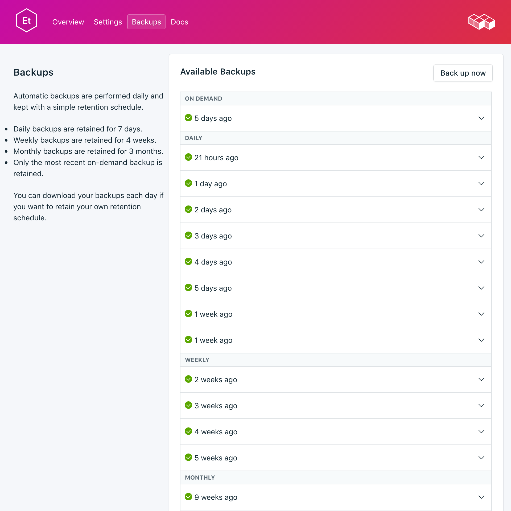
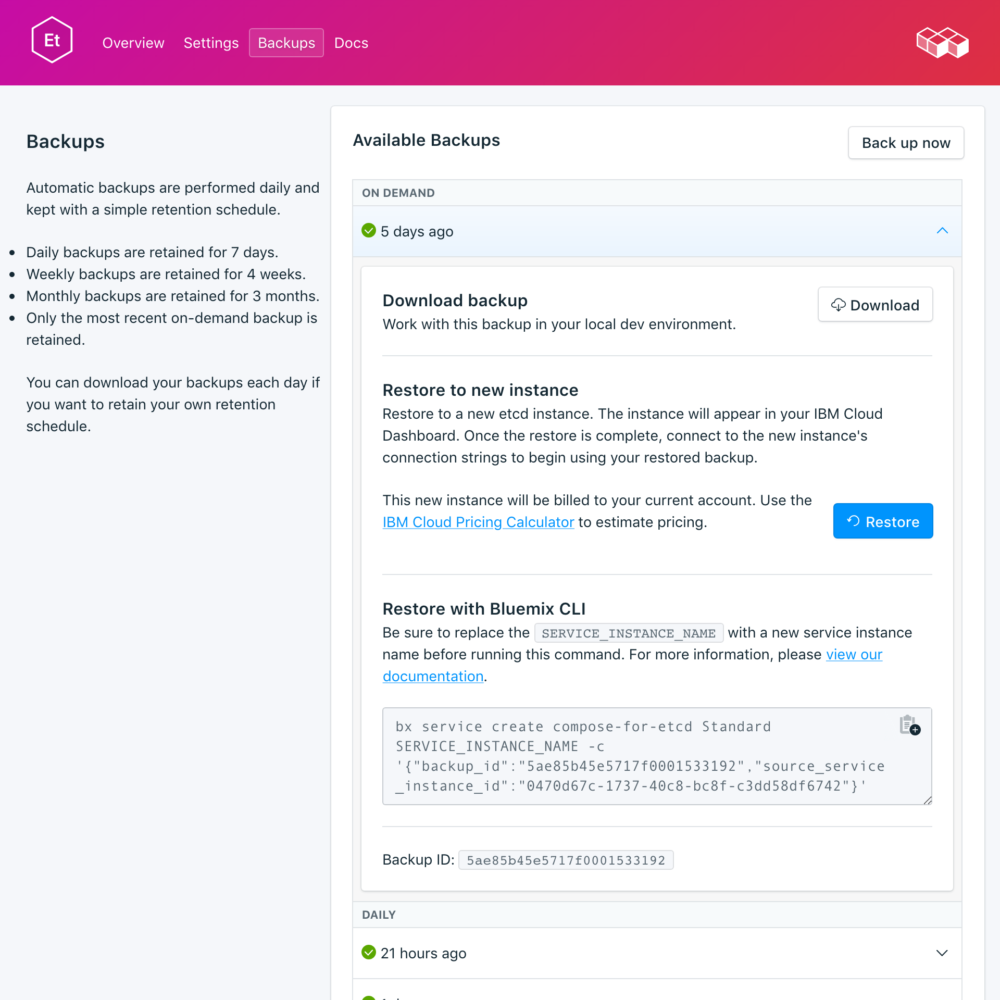

---

copyright:
  years: 2017,2018
lastupdated: "2017-10-16"

keywords: etcd, compose

subcollection: compose-for-etcd

---

{:new_window: target="_blank"}
{:shortdesc: .shortdesc}
{:screen: .screen}
{:codeblock: .codeblock}
{:pre: .pre}

# Backups
{: #dashboard-backups}

You can create and download backups from the _Backups_ tab of the _Manage_ page of your service dashboard. Daily, weekly, monthly, and on-demand backups are available. They are retained according to the following schedule:

Backup type|Retention schedule
----------|-----------
Daily|Daily backups are retained for 7 days
Weekly|Weekly backups are retained for 4 weeks
Monthly|Monthly backups are retained for 3 months
On-demand|One on-demand backup is retained. The retained backup is always the most recent on-demand backup.
{: caption="Table 1. Backup retention schedule" caption-side="top"}

Backup schedules and retention policies are fixed. If you need to keep more backups than the retention schedule allows, download backups and retain archives according to your business requirements.

## Viewing existing backups

Daily backups of your database are automatically scheduled. To view your existing backups:

1. Go to the _Manage_ page of your service Dashboard.
2. Click **Backups** in the tabs to open the _Backups_ page. A list of available backups is shown.

  

3. Click the corresponding row to expand the options for any available backup.

   

### Using the API to view existing backups

A list of backups is available at the `GET /2016-07/deployments/:id/backups` endpoint. The Foundation Endpoint with the service instance ID and the deployment ID are both shown in the service's _Overview_.

``` 
https://composebroker-dashboard-public.mybluemix.net/api/2016-07/instances/$INSTANCE_ID/deployments/$DEPLOYMENT_ID/backups
```  

## Creating a manual backup

To create a manual backup, follow the steps to view existing backups, then click **Back up now**. A message is displayed that a backup is in progress, and a 'pending' backup is added to the list of available backups.

### Using the API to create a backup

Send a POST request to the backups endpoint to initiate a manual backup.

```
POST /2016-07/deployments/:id/backups
```

It returns immediately with the recipe ID, and information about the backup as it is running. You need to check the backups endpoint to see whether the backup task is complete, and find the backup_id before you can use it. Use `GET /2016-07/deployments/:id/backups/`.

## Downloading a backup

1. Follow the steps to view existing backups
2. Click in the corresponding row to expand the options for the backup you want to download.
3. Click **Download**.

The compressed file contains a binary snapshot of your data that you can use locally.

### Using the API to download a backup

1. Find the backup that you want to restore from on the _Backups_ page on your service and copy the backup_id, or use `GET /2016-07/deployments/:id/backups` to find a backup and its `backup_id` through the Compose API.
2. Use the `backup_id` value to find information and a download link for a specific backup.

  ```
  GET /2016-07/deployments/:id/backups/:backup_id
  ```

## Restoring a backup

1. Follow the steps to view existing backups
2. Click in the corresponding row to expand the options for the backup you want to download.
3. Click **Restore**. A message is displayed that a restore has been initiated.

The new service instance is automatically given the name "etcd-restore-[timestamp]", and appears on your dashboard when provisioning starts.

### Restoring from the {{site.data.keyword.cloud_notm}} CLI

Use the following steps to restore a backup from a running etcd service to a new etcd service by using the {{site.data.keyword.cloud_notm}} CLI. 

1. If you need to, [download and install the CLI](/docs/cli?topic=cloud-cli-overview). 
2. Find the backup that you want to restore from on the _Backups_ page on your service and copy the backup ID.

  **Or**  
  Use the `GET /2016-07/deployments/:id/backups` to find a backup and its ID through the Compose API. The Foundation Endpoint and the service instance ID are both shown in the service's _Overview_. For example: 
  ``` 
  https://composebroker-dashboard-public.mybluemix.net/api/2016-07/instances/$INSTANCE_ID/deployments/$DEPLOYMENT_ID/backups
  ```  
  The response contains a list of all available backups for that service instance. Pick the backup that you would like to restore from and copy the backup ID.

3. Log in with the appropriate account and credentials. Use `ibmcloud login`, or use `ibmcloud login -help` to see all the login options.

4. Switch to your Organization and Space. Use `ibmcloud target -o "$YOUR_ORG" -s "YOUR_SPACE"`

5. Use the `service create` command to provision a new service. Provide the source service and the specific backup that you are restoring in a JSON object. For example:

  ``` 
  ibmcloud service create SERVICE PLAN SERVICE_INSTANCE_NAME -c '{"source_service_instance_id": "$SERVICE_INSTANCE_ID", "backup_id": "$BACKUP_ID" }'
  ```

  <dl>
  <dt>_SERVICE_</dt>
  <dd>Use `compose-for-redis`.</dd>
  <dt>_PLAN_</dt>
  <dd>Use either Standard or Enterprise depending on your environment.</dd>
  <dt>_SERVICE\_INSTANCE\_NAME_</dt>
  <dd>The name of your new service.</dd>
  <dt>_source\_service\_instance\_id_</dt>
  <dd>The service instance ID of the source of the backup. You can obtain the value by running `ibmcloud cf service DISPLAY_NAME --guid`, where _DISPLAY\_NAME_ is the name of the service the backup is from. </dd>
  </dl>
  
  Enterprise users also need to specify which cluster to deploy to in the JSON object with the `"cluster_id": "$CLUSTER_ID"` parameter.
  
### Migrating to a New Version

Some major version upgrades are not available in the current running deployment. You need to provision a new service that is running the upgraded version, and then migrate your data into the new service, by using a backup. This process is the same a restoring a backup, except you specify the version that you want to upgrade to.

``` 
ibmcloud service create SERVICE PLAN SERVICE_INSTANCE_NAME -c '{"source_service_instance_id": "$SERVICE_INSTANCE_ID", "backup_id": ""$BACKUP_ID", "db_version":"$VERSION_NUMBER" }'
```

For example, to restore an older version of a {{site.data.keyword.composeForEtcd}} service to a new service running etcd 3.2.13, use the following command:

```
ibmcloud service create compose-for-etcd Standard migrated_etcd -c '{ "source_service_instance_id": "0269e284-dcac-4618-89a7-f79e3f1cea6a", "backup_id":"5a96d8a7e16c090018884566", "db_version":"3.2.13"  }'
```

