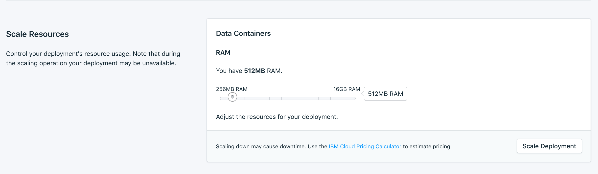
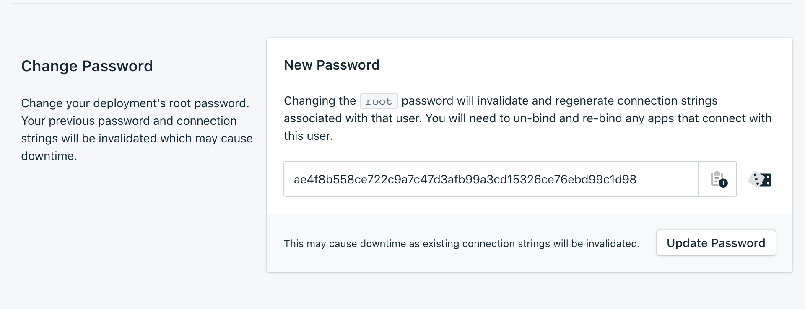
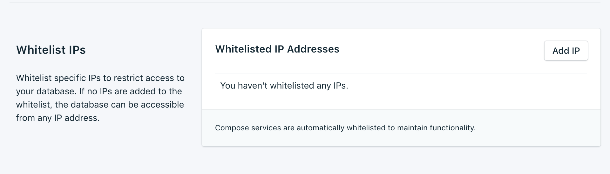

---

Copyright:
  years: 2017,2018
lastupdated: "2017-10-23"

keywords: etcd, compose

subcollection: ComposeForEtcd

---

{:new_window: target="_blank"}
{:shortdesc: .shortdesc}
{:screen: .screen}
{:codeblock: .codeblock}
{:pre: .pre}
{:tip: .tip}

# Settings
{: #dashboard-settings}

These features allow you to adapt your {{site.data.keyword.composeForEtcd_full}} service to better suit your needs and requirements.

## Upgrade Version

If your service is already on the newest version available, the panel displays the current version information. If a new version of the database is available, a drop-down menu appears, from which you can select a version to upgrade to.

## Scaling Resources

If your service needs additional memory, or you want to reduce the amount of memory allocated to your service, you can do this by scaling resources.

1. Navigate to your service's dashboard overview page.
2. In the _Deployment Details_ pane, click **Scale Resources**. The Scale Resouces page opens.
    
3. Adjust the slider to raise or lower the memory allocated to the {{site.data.keyword.composeForEtcd}} service. Move the slider to the left to reduce the amount of memory, or move it to the right to increase the memory.
4. Click **Scale Deployment** to trigger the rescaling and return to the dashboard overview. 

When the scaling is complete the _Deployment Details_ pane updates to show the current usage and the new value for the available memory.

## Changing the password

You might find it necessary to change the password of your service.

1. Go to the _Change Password_ panel. 

  You can use the randomly generated password that is created for you, or you can type your own password into the field. To regenerate a new random password, click the dice. 
  
  

2. Click **Update Password**. You are asked to confirm the change.
3. Click **Update Password** in the dialog to confirm the new password, or click **cancel** to cancel the change. The _Deployment Details_ pane shows the progress of the running job.

**Note:** Changing the password changes the credentials that you and your services use to connect, and invalidates your service's connection string. It can also result in downtime.

### Updating Connected Applications

Changing the password invalidates the existing connection string and generate a new one. This can cause a service interruption until connected applications are updated with the new connection string.

For more information about connecting your applications see [Connecting an {{site.data.keyword.cloud}} Application](/docs/ComposeForEtcd?topic=ComposeForEtcd-ibmcloud-cf-app), and [Connecting an external application](/docs/ComposeForEtcd?topic=ComposeForEtcd-external-app).

## Using Whitelists

If you want to restrict access to your databases, you can whitelist specific IP addresses or ranges of IP addresses on your service. When the whitelist contains no IP addresses, the whitelist is disabled and the deployment accepts connections from any system on the internet.

### IP addresses
The *IP* field can take a single complete IPv4 address or IPv6 address with or without a netmask. Without a netmask, incoming connections must come from exactly that IP address. 

**Note:** although the *IP* field allows for IPv6, no Compose deployments are currently available to IPv6 networking, and so these addresses cannot be filtered on.

### Netmasks

To allow a connection from a specified range of IP addresses, use a netmask. The IP address must be fully specified when you use a netmask. That means entering, for example, `192.168.1.0/24` rather than `192.168.1/24`.

### Description

The *Description* can be any text for identifying the whitelist entry - a customer name, project identifier, or employee number, for example. The description field is required.

### Compose Services
Whitelist entries are automatically added to Compose's servers to allow them to connect.

### Removing Whitelisted IP addresses
To remove an IP address or netmask from the Whitelist, click *Remove IP* in the corresponding row.
When all entries on the whitelist are removed, the whitelist is disabled and all IP addresses are accepted by the TCP access portals.
