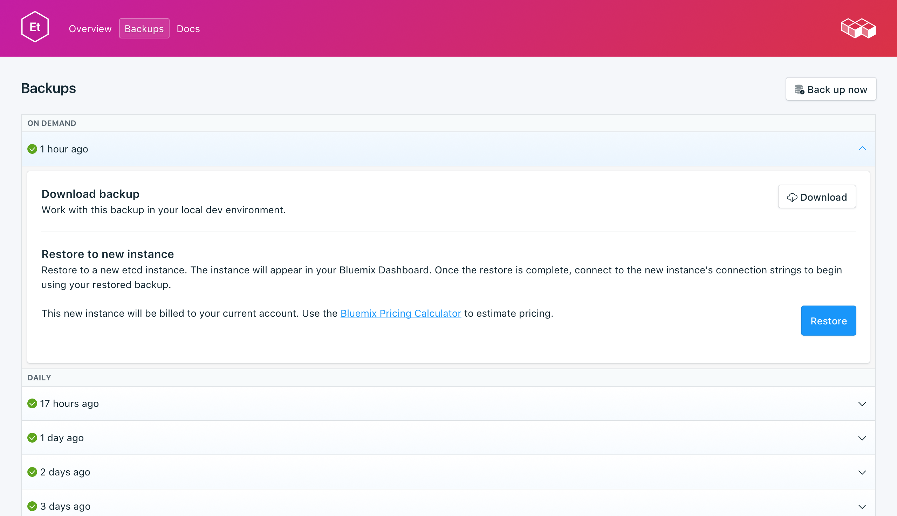

---

copyright:
  years: 2017
lastupdated: "2017-10-16"
---

{:new_window: target="_blank"}
{:shortdesc: .shortdesc}
{:screen: .screen}
{:codeblock: .codeblock}
{:pre: .pre}

# Sicherungen
{: #backups}

Sie können Sicherungen erstellen und über die Registerkarte _Sicherungen_ der Seite *Verwalten* Ihres Service-Dashboards herunterladen. Es sind sowohl geplante als auch manuelle Sicherungen verfügbar. Es sind sowohl geplante als auch manuelle Sicherungen verfügbar.

## Vorhandene Sicherungen anzeigen

Tägliche Sicherungen Ihrer Datenbank werden automatisch geplant. Gehen Sie wie folgt vor, um Ihre vorhandenen Sicherungen anzuzeigen:

1. Navigieren Sie zu der Seite _Verwalten_ Ihres Service-Dashboards.
2. Klicken Sie auf die Registerkarte **Sicherungen**, um die Seite _Sicherungen_ zu öffnen. Es wird eine Liste der verfügbaren Sicherungen angezeigt:

  

Klicken Sie in eine Zeile, um die Optionen für die entsprechende verfügbare Sicherung zu erweitern.  

## Manuelle Sicherung erstellen

Neben geplanten Sicherungen können Sie manuelle Sicherungen erstellen. Führen Sie zum Erstellen einer manuellen Sicherung die Schritte zum Anzeigen der vorhandenen Sicherungen aus. Klicken Sie dann über der Liste der vorhandenen Sicherungen auf **Jetzt sichern**. Es wird eine Nachricht darüber angezeigt, dass eine Sicherung eingeleitet wurde, und zur Liste der verfügbaren Sicherungen wird eine 'anstehende' Sicherung hinzugefügt.

## Sicherung herunterladen

Führen Sie zum Herunterladen einer Sicherung die Schritte zum Anzeigen der vorhandenen Sicherungen aus. Klicken Sie dann in die entsprechende Zeile, um die Optionen für die Sicherung zu erweitern, die Sie herunterladen wollen. Klicken Sie auf die Schaltfläche **Herunterladen**. Die komprimierte Datei enthält einen binären Snapshot Ihrer Daten zur lokalen Verwendung.

## Sicherung wiederherstellen
Führen Sie zum Wiederherstellen einer Sicherung in eine neue Serviceinstanz die Schritte zum Anzeigen der vorhandenen Sicherungen aus. Klicken Sie dann in die entsprechende Zeile, um die Optionen für die Sicherung zu erweitern, die Sie herunterladen wollen. Klicken Sie auf die Schaltfläche **Wiederherstellen**. Es wird eine Nachricht darüber angezeigt, dass eine Wiederherstellung eingeleitet wurde. Die neue Serviceinstanz erhält automatisch den Namen "etcd-restore-[timestamp]" und wird beim Start der Bereitstellung in Ihrem Dashboard angezeigt.
