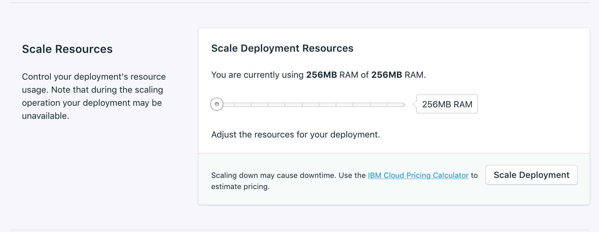

---

Copyright:
  years: 2017,2018
lastupdated: "2017-10-23"
---

{:new_window: target="_blank"}
{:shortdesc: .shortdesc}
{:screen: .screen}
{:codeblock: .codeblock}
{:pre: .pre}
{:tip: .tip}

# Einstellungen

Mit diesen Funktionen können Sie Ihren {{site.data.keyword.composeForEtcd_full}}-Service besser an Ihre Bedürfnisse und Anforderungen anpassen.

## Upgradeversion

 Wenn sich Ihr Service bereits auf dem neuesten verfügbaren Versionsstand befindet, werden in der Anzeige die aktuellen Versionsinformationen angezeigt. Wenn eine neue Version der Datenbank verfügbar ist, wird ein Dropdown-Menü angezeigt, in dem Sie die Version auswählen können, auf die das Upgrade durchgeführt werden soll.

## Ressourcen skalieren

Wenn Ihr Service zusätzlichen Speicher benötigt oder Sie den Speicherplatz verringern wollen, der Ihrem Service zugeordnet ist, können Sie dazu die Ressourcen skalieren.

1. Navigieren Sie zur Übersichtsseite Ihres Service-Dashboards.
2. Klicken Sie in der Anzeige _Bereitstellungsdetails_ auf **Ressourcen skalieren**. Die Seite 'Ressourcen skalieren' wird geöffnet. 
3. Passen Sie den Schieberegler an, um den Speicher zu erhöhen oder zu verringern, der dem {{site.data.keyword.composeForEtcd}}-Service zugeordnet ist. Verschieben Sie den Schieberegler nach links, um den Speicherplatz zu verringern, oder nach rechts, um ihn zu erhöhen.
4. Klicken Sie auf **Bereitstellung skalieren**, um die Neuskalierung auszulösen und zur Dashboardübersicht zurückzukehren. 

Nach dem Abschluss der Skalierung wird die Anzeige _Bereitstellungsdetails_ aktualisiert und zeigt die aktuelle Nutzung sowie den neuen Wert für den verfügbaren Speicher an.

## Kennwort ändern

Möglicherweise finden Sie es erforderlich, das Kennwort Ihres Service zu ändern. Eine solche Änderung können Sie im Fenster _Kennwort ändern_ vornehmen. 

Sie können das zufällig generierte Kennwort verwenden, das für Sie erstellt wird, oder Sie können ein eigenes Kennwort in das Feld eingeben. Wenn automatisch ein beliebiges neues Kennwort generiert werden soll, klicken Sie rechts neben dem Feld auf den Würfel. 
  

Klicken Sie auf **Kennwort aktualisieren**. Sie werden aufgefordert, die Änderung zu bestätigen. Klicken Sie im Dialog auf **Kennwort aktualisieren**, um das neue Kennwort zu bestätigen, oder brechen Sie die Änderung ab. Im Teilfenster _Bereitstellungsdetails_ wird der Verarbeitungsfortschritt des Jobs angezeigt.

**Hinweis:** Durch Ändern des Kennworts werden die Berechtigungsnachweise geändert, mit denen Sie und Ihre Services eine Verbindung herstellen, und die Verbindungszeichenfolge Ihres Service wird ungültig. Dies kann auch zu Ausfallzeiten führen.

### Verbundene Anwendungen aktualisieren
Die Änderung des Kennworts bewirkt, dass die vorhandene Verbindungszeichenfolge ungültig und eine neue generiert wird. Dies kann zu einer Serviceunterbrechung führen, bis die verbundenen Anwendungen mit der neuen Verbindungszeichenfolge aktualisiert worden sind.

Weitere Informationen zum Herstellen von Verbindungen für Ihre Anwendungen finden Sie in [{{site.data.keyword.cloud}}-Anwendung verbinden](./connecting-bluemix-app.html) und [Externe Anwendung verbinden](./connecting-external.html).

## Whitelists verwenden

Wenn Sie den Zugriff auf Ihre Datenbank beschränken wollen, können Sie bestimmte IP-Adressen oder IP-Adressbereiche für Ihren Service auf eine Whitelist setzen. Wenn in der Whitelist keine IP-Adressen enthalten sind, wird die Whitelist inaktiviert und die Bereitstellung akzeptiert Verbindungen von jedem System im Internet.

### IP-Adressen
Das Feld *IP* kann eine einzelne vollständige IPv4- oder IPv6-Adresse mit oder ohne Netzmaske annehmen. Ohne Netzmaske müssen eingehende Verbindungen von genau dieser IP-Adresse kommen. 

**Hinweis:** Für den IP-Eintrag ist zwar IPv6 zulässig, doch derzeit sind keine Compose-Bereitstellungen für den IPv6-Netzbetrieb verfügbar, sodass keine Filterung dieser Adressen möglich ist.

### Netzmasken
Verwenden Sie eine Netzmaske, um eine Verbindung von einem angegebenen IP-Adressbereich zuzulassen. Bei Verwendung einer Netzmaske muss die IP-Adresse vollständig angegeben werden. Es muss also beispielsweise `192.168.1.0/24` statt `192.168.1/24` eingegeben werden.

### Beschreibung
Die *Beschreibung* kann ein beliebiger Text zur Kenntlichmachung des Eintrags in der Whitelist sein, beispielsweise ein Kundenname, eine Projekt-ID oder eine Personalnummer. Das Beschreibungsfeld ist erforderlich.

### Compose-Services
Einträge in die Whitelist werden automatisch zu den Compose-Servern hinzugefügt, damit sie eine Verbindung herstellen können.

### In der Whitelist aufgeführte IP-Adressen entfernen
Wenn Sie eine IP-Adresse oder Netzmaske aus der Whitelist entfernen wollen, klicken in der entsprechenden Zeile auf *IP entfernen*.
Wenn alle Einträge in der Whitelist entfernt werden, wird die Whitelist inaktiviert und die TCP-Zugriffsportale akzeptieren alle IP-Adressen.
