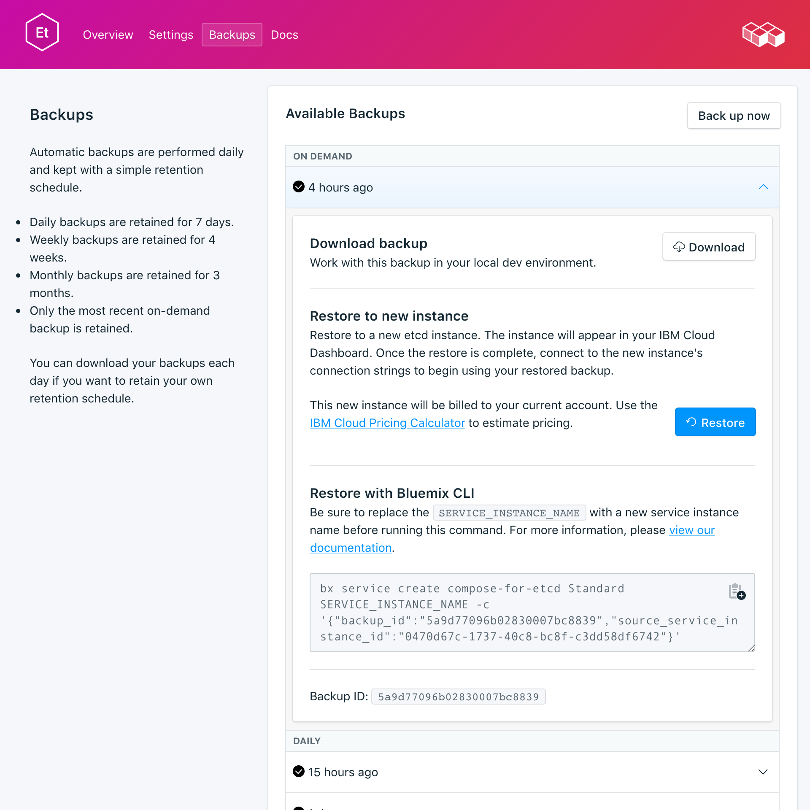

---

copyright:
  years: 2017,2018
lastupdated: "2017-10-16"
---

{:new_window: target="_blank"}
{:shortdesc: .shortdesc}
{:screen: .screen}
{:codeblock: .codeblock}
{:pre: .pre}

# Copias de seguridad
{: #backups}

Puede crear y descargar copias de seguridad desde el separador _Copias de seguridad_ de la página _Gestionar_ del panel de control del servicio. Las copias de seguridad diarias, semanales, mensuales y bajo demanda están disponibles. Se retienen según la siguiente planificación:

Tipo de copia de seguridad|Planificación de retención
----------|-----------
Diario|Las copias de seguridad diarias se retienen durante 7 días
Semanal|Las copias de seguridad semanales se retienen durante 4 semanas
Mensual|Las copias de seguridad mensuales se retienen durante 3 meses
Bajo demanda|Se retiene una copia de seguridad bajo demanda. La copia de seguridad retenida es siempre la copia de seguridad bajo demanda más reciente.
{: caption="Tabla 1. Planificación de retención de copia de seguridad" caption-side="top"}

Las planificaciones de copia de seguridad y las políticas de retención están corregidas. Si necesita mantener más copias de seguridad de las que permite la planificación de retención, descargue copias de seguridad y retenga archivados según sus necesidades empresariales.

## Visualización de las copias de seguridad existentes

Se planifican automáticamente copias de seguridad diarias de la base de datos. Para ver las copias de seguridad existentes:

1. Vaya a la página _Gestionar_ del panel de control del servicio.
2. Pulse **Copias de seguridad** en los separadores para abrir la página _Copias de seguridad_. Aparecerá una lista de las copias de seguridad disponibles:

  

Pulse la fila correspondiente para ampliar las opciones para cualquier copia de seguridad disponible.

   

### Utilización de la API para ver las copias de seguridad existentes

Hay una lista de copias de seguridad disponible en el punto final `GET /2016-07/deployments/:id/backups`. El punto final de la fundación con el ID de la instancia de servicio y el ID de despliegue se muestran en la _Visión general_ del servicio.

``` 
https://composebroker-dashboard-public.mybluemix.net/api/2016-07/instances/$INSTANCE_ID/deployments/$DEPLOYMENT_ID/backups
```  

## Creación de una copia de seguridad manual

Además de copias de seguridad planificadas, puede crear una copia de seguridad manualmente. Para crear una copia de seguridad manual, siga los pasos para ver las copias de seguridad existentes y luego pulse **Copia de seguridad ahora** sobre la lista de copias de seguridad disponibles. Se mostrará un mensaje que le indicará que la copia de seguridad se ha iniciado y se añade una copia de seguridad 'pendiente' a la lista de copias de seguridad disponibles.

### Utilización de la API para crear una copia de seguridad

Envíe una solicitud POST al punto final de las copias de seguridad para iniciar una copia de seguridad manual: `POST /2016-07/deployments/:id/backups`. Se devuelve inmediatamente con el ID de receta e información sobre la copia de seguridad mientras está en ejecución. Es necesario comprobar el punto final de copias de seguridad para ver si la copia de seguridad ha finalizado y buscar su backup_id antes de utilizarla. Utilice `GET /2016-07/deployments/:id/backups/`.

## Descarga de una copia de seguridad

Para descargar una copia de seguridad, siga los pasos para ver las copias de seguridad existentes y luego pulse en la fila correspondiente para ampliar las opciones para la copia de seguridad que desea descargar y pulse **Descargar**. El archivo comprimido contiene una instantánea binaria de los datos para su uso local.

### Utilización de la API para descargar una copia de seguridad

Busque la copia de seguridad que desea restaurar en la página _Copias de seguridad_ del servicio y copie el backup_id, o utilice `GET /2016-07/deployments/:id/backups` para buscar una copia de seguridad y su `backup_id` mediante la API de Compose. A continuación, utilice el `backup_id` para buscar información y un enlace de descarga de una copia de seguridad específica: `GET /2016-07/deployments/:id/backups/:backup_id`.

## Restauración de una copia de seguridad

Para restaurar una copia de seguridad en una nueva instancia de servicio, siga los pasos para ver las copias de seguridad existentes y luego pulse en la fila correspondiente para ampliar las opciones para la copia de seguridad que desea descargar y pulse **Restaurar**. Se mostrará un mensaje que le indicará que se ha iniciado una restauración. A la nueva instancia del servicio se le asigna automáticamente el nombre "etcd-restore-[timestamp]" y aparece en el panel de control cuando comienza el suministro.

### Restauración mediante la CLI de {{site.data.keyword.cloud_notm}}

Utilice los pasos siguientes para restaurar una copia de seguridad de un servicio etcd en ejecución a un servicio etcd nuevo mediante la CLI de {{site.data.keyword.cloud_notm}}. 

1. Si es necesario, [descargue e instale la CLI](https://console.{DomainName}/docs/cli/index.html#overview). 

2. Busque la copia de seguridad que desea restaurar en la página _Copias de seguridad_ del servicio y copie el ID de copia de seguridad.

  **O**  
  Utilice `GET /2016-07/deployments/:id/backups` para buscar una copia de seguridad y su ID mediante la API de Compose. El punto final de la fundación y el ID de la instancia de servicio se muestran en la _Visión general_ del servicio. Por ejemplo: 
  ``` 
  https://composebroker-dashboard-public.mybluemix.net/api/2016-07/instances/$INSTANCE_ID/deployments/$DEPLOYMENT_ID/backups
  ```  
  La respuesta contiene una lista de todas las copias de seguridad disponibles para dicha instancia de servicio. Seleccione la copia de seguridad desde la que desea restaurar y copie el ID de copia de seguridad.

3. Inicie sesión con la cuenta y las credenciales adecuadas. `ibmcloud login` (o `ibmcloud login -help` para ver todas las opciones de inicio).

4. Vaya a su organización y espacio `ibmcloud target -o "$YOUR_ORG" -s "YOUR_SPACE"`

5. Utilice el mandato `service create` para suministrar un nuevo servicio. Proporcione el servicio de origen y la copia de seguridad específica que va a restaurar en un objeto JSON. Por ejemplo:

  ``` 
  ibmcloud service create SERVICE PLAN SERVICE_INSTANCE_NAME -c '{"source_service_instance_id": "$SERVICE_INSTANCE_ID", "backup_id": "$BACKUP_ID" }'
  ```

  - Para _SERVICE_, escriba `compose-for-etcd`
  - _PLAN_ puede ser Standard o Enterprise, dependiendo del entorno.
  - _SERVICE\_INSTANCE\_NAME_ es el nombre del nuevo servicio.
  - Para _source\_service\_instance\_id_, escriba el ID de instancia de servicio del origen de la copia de seguridad; puede obtener este valor ejecutando `ibmcloud cf service DISPLAY_NAME --guid`, donde _DISPLAY\_NAME_ es el nombre del servicio etcd del que es la copia de seguridad. 
  
  Los usuarios empresariales también deben utilizar el parámetro `"cluster_id": "$CLUSTER_ID"` en el objeto JSON para especificar en qué clúster se va a desplegar.
  
### Migración a una nueva versión

Algunas actualizaciones de versión principal no están disponibles en el despliegue en ejecución actual. Debe suministrar un nuevo servicio que esté ejecutando la versión actualizada y luego migrar los datos al nuevo servicio mediante una copia de seguridad. Este proceso es el mismo que restaurar una copia de seguridad, excepto que se especifica la versión a la que desea actualizar.

``` 
ibmcloud service create SERVICE PLAN SERVICE_INSTANCE_NAME -c '{"source_service_instance_id": "$SERVICE_INSTANCE_ID", "backup_id": ""$BACKUP_ID", "db_version":"$VERSION_NUMBER" }'
```

Por ejemplo, para restaurar de una versión anterior de un servicio {{site.data.keyword.composeForEtcd}} a un servicio nuevo que ejecute etcd 3.2.13, utilice el siguiente mandato:

```
ibmcloud service create compose-for-etcd Standard migrated_etcd -c '{ "source_service_instance_id": "0269e284-dcac-4618-89a7-f79e3f1cea6a", "backup_id":"5a96d8a7e16c090018884566", "db_version":"3.2.13"  }'
```

