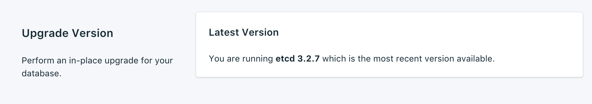
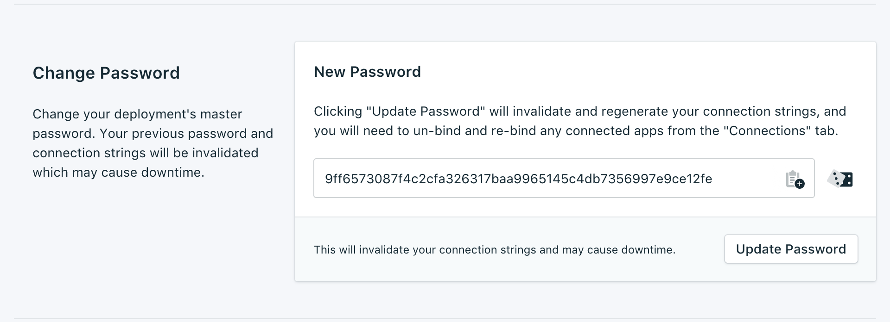
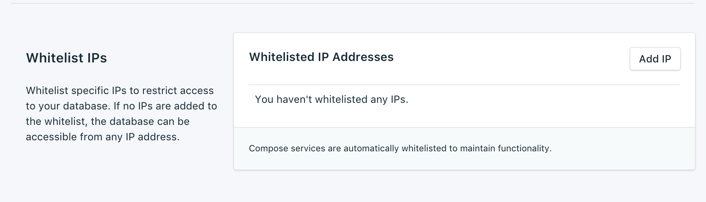

---

Copyright:
  years: 2017,2018
lastupdated: "2017-10-23"
---

{:new_window: target="_blank"}
{:shortdesc: .shortdesc}
{:screen: .screen}
{:codeblock: .codeblock}
{:pre: .pre}
{:tip: .tip}

# 設定

これらの機能を使用して、{{site.data.keyword.composeForEtcd_full}} サービスをニーズと要件にさらに適応させることができます。

## バージョンのアップグレード

 現在のサービスが使用可能な最新バージョンを既に使用している場合、現行バージョンの情報がパネルに表示されます。 新バージョンのデータベースを使用できるようになった場合は、ドロップダウン・メニューが表示され、アップグレード後のバージョンを選択できます。

## リソースの拡大縮小

サービスが追加メモリーを必要とする場合や、サービスに割り振られたメモリー量を減らす場合は、リソースを拡大縮小することによって行えます。

1. サービスのダッシュボードの概要ページにナビゲートします。
2. _「デプロイメントの詳細 (Deployment Details)」_ペインで、**「リソースのスケール (Scale Resources)」**をクリックします。 「リソースのスケール (Scale Resouces)」ページが開きます。
    」ページ")
3. スライダーを調整して、{{site.data.keyword.composeForEtcd}} サービスに割り振られたメモリーを大きくしたり小さくしたりします。 スライダーを左に移動するとメモリー量が減り、右に移動するとメモリーが増えます。
4. **「デプロイメントの拡大縮小 (Scale Deployment)」**をクリックしてスケール変更をトリガーし、ダッシュボードの概要に戻ります。 

スケーリングが完了すると、_「デプロイメントの詳細 (Deployment Details)」_ペインが更新され、メモリーの現在の使用量と使用可能な量を示す新しい値が表示されます。

## パスワードの変更

サービスのパスワードを変更しなければならないことがあります。 これは、_「パスワードの変更」_パネルから行えます。 

ランダムに自動生成されたパスワードを使用することもできますし、独自のパスワードをフィールドに入力することもできます。 新しいランダム・パスワードを再生成するには、フィールドの右側にあるダイスをクリックします。 
  

**「パスワードの更新 (Update Password)」**をクリックします。 変更を確認するよう求められます。 ダイアログの**「パスワードの更新 (Update Password)」**をクリックして新規パスワードを確定させるか、キャンセルして変更を取り消します。 _「デプロイメントの詳細 (Deployment Details)」_ペインに、実行中のジョブの進行状況が表示されます。

**注:** パスワードを変更すると、ユーザーとサービスが接続で使用する資格情報が変更され、サービスの接続ストリングが無効になります。 ダウン時間が発生することもあります。

### 接続されたアプリケーションの更新
パスワードを変更すると、既存の接続ストリングが無効になり、新しいパスワードが生成されます。 そのため、接続されたアプリケーションを新しい接続ストリングで更新するまで、サービスが中断することがあります。

アプリケーションの接続方法について詳しくは、[{{site.data.keyword.cloud}} アプリケーションの接続](./connecting-bluemix-app.html)と
[外部アプリケーションの接続](./connecting-external.html)を参照してください。

## ホワイトリストの使用

データベースへのアクセスを制限するには、サービスの特定の IP アドレスまたは IP アドレスの範囲をホワイトリストに登録します。 ホワイトリスト内に IP アドレスが存在しない場合、ホワイトリストは無効化され、デプロイメントはインターネット上のすべてのシステムからの接続を受け入れます。

### IP アドレス
*「IP」*フィールドには、単一の完全な IPv4 アドレスまたは IPv6 アドレス (ネットマスクは付けても付けなくてもかまいません) を指定できます。 ネットマスクを付けない場合、着信接続は、正確にその IP アドレスからの接続でなければなりません。 

**注:** IP エントリーには IPv6 を使用できますが、IPv6 ネットワーキングに使用できる Compose デプロイメントは現在ありません。そのため、これらのアドレスをフィルターに掛けることはできません。

### ネットマスク
指定した範囲の IP アドレスからの接続を許可するには、ネットマスクを使用します。 ネットマスクを使用するときは、IP アドレスを完全に指定する必要があります。 これは、例えば、`192.168.1/24` ではなく `192.168.1.0/24` と入力することを意味します。

### 説明
*「説明」*は、ホワイトリスト・エントリーを識別するための、任意のテキスト (例えば、顧客名、プロジェクト ID、従業員番号など) にすることができます。 「説明」フィールドは必須です。

### Compose サービス
ホワイトリストのエントリーは Compose サービスに自動的に追加され、接続を許可されるようになります。

### ホワイトリストからの IP アドレスの削除
ホワイトリストから IP アドレスまたはネットマスクを削除するには、対応する行の*「IP の削除 (Remove IP)」*をクリックします。
ホワイトリストのエントリーをすべて削除すると、ホワイトリストが無効になり、すべての IP アドレスが TCP アクセス・ポータルに受け入れられるようになります。
