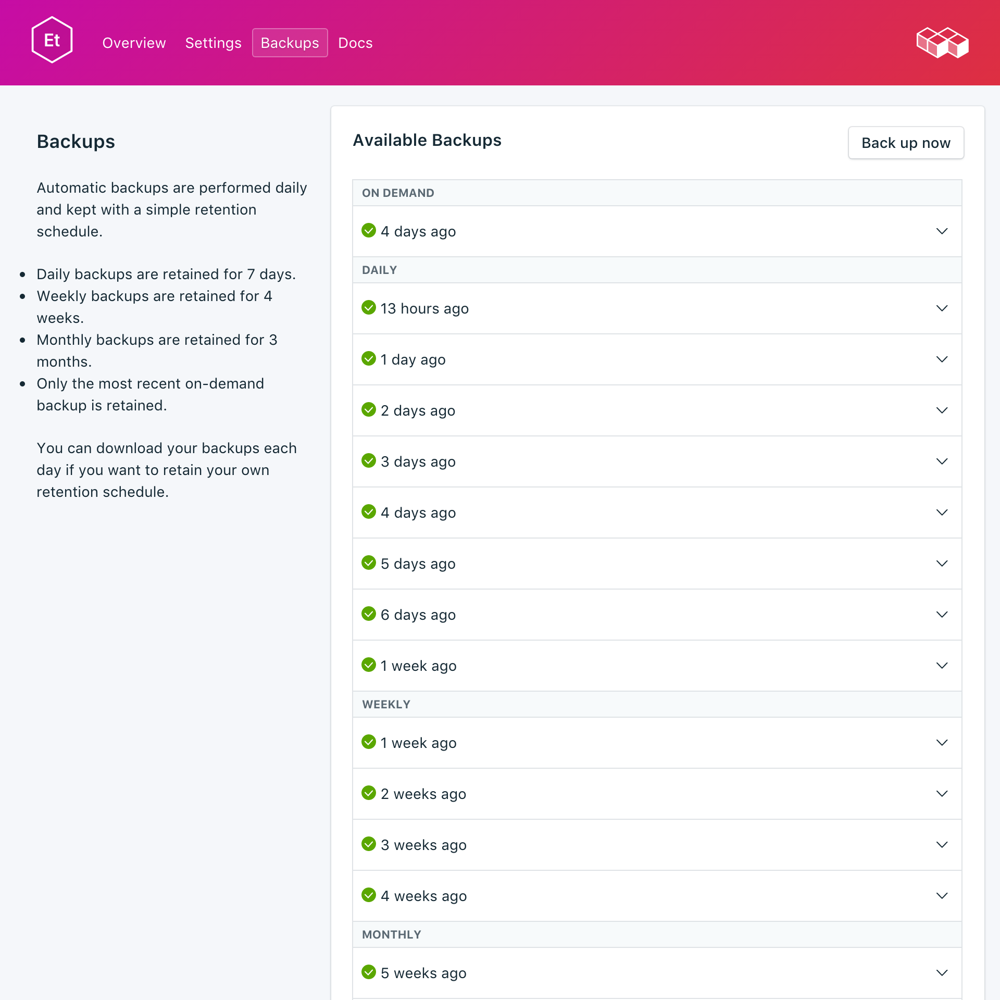
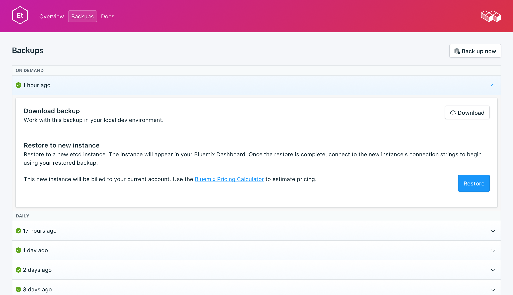

---

copyright:
  years: 2017,2018
lastupdated: "2017-10-16"
---

{:new_window: target="_blank"}
{:shortdesc: .shortdesc}
{:screen: .screen}
{:codeblock: .codeblock}
{:pre: .pre}

# Backups
{: #backups}

É possível criar e fazer download de backups na guia _Backups_ da página _Gerenciar_ de seu painel de serviço. Backups diários, mensais e on demand estão disponíveis. Eles são retidos de acordo com planejamento a seguir:

Tipo de backup|Planejamento de retenção
----------|-----------
Diárias|Os backups diários são retidos por 7 dias
Semanal|Backups semanais são retidos por 4 semanas
Mensal|Backups mensais são retidos por 3 meses
On demand|Um backup on demand é retido. O backup retido é sempre o backup on demand mais recente.
{: caption="Tabela 1. Planejamento de retenção de backup" caption-side="top"}

Planejamentos de backup e políticas de retenção são fixos. Se for necessário manter mais backups do que o permitido pelo planejamento de retenção, faça download de backups e retenha archives de acordo com a necessidade de negócios.

## Visualizando backups existentes

Os backups diários de seu banco de dados são planejados automaticamente. Para visualizar seus backups existentes:

1. Navegue para a página _Gerenciar_ de seu Painel de serviço.
2. Clique em **Backups** nas guias para abrir a página _Backups_. Uma lista de backups disponíveis é mostrada:

  

Clique na linha correspondente para expandir as opções de qualquer backup disponível.

   

### Usando a API para visualizar backups existentes

Uma lista de backups está disponível no terminal `GET /2016-07/deployments/:id/backups`. O Terminal base com o ID da instância de serviço e o ID de implementação são mostrados na _Visão geral_ do serviço.

``` 
https://composebroker-dashboard-public.mybluemix.net/api/2016-07/instances/$INSTANCE_ID/deployments/$DEPLOYMENT_ID/backups
```  

## Criando um backup manual

Além de backups planejados, é possível criar um backup manualmente. Para criar um backup manual, siga as etapas para visualizar os backups existentes, em seguida, clique em **Fazer backup agora** acima da lista de backups disponíveis. Uma mensagem é exibida para permitir que você saiba que um backup foi iniciado e um backup 'pendente' é incluído na lista de backups disponíveis.

### Usando a API para criar um backup

Envie uma solicitação POST para o terminal de backups para iniciar um backup manual: `POST /2016-07/deployments/:id/backups`. Ele retorna imediatamente com o ID da orientação e informações sobre o backup conforme ele está em execução. Será necessário verificar no terminal de backups se o backup foi concluído e localizar o backup_id antes de usá-lo. Use `GET /2016-07/deployments/:id/backups/`.

## Fazendo download de um backup

Para fazer download de um backup, siga as etapas para visualizar backups existentes e, em seguida, clique na linha correspondente para expandir as opções do backup que você deseja fazer download e clique em **Download**. O arquivo compactado contém uma captura instantânea binária de seus dados para ser usada localmente.

### Usando a API para fazer download de um backup

Localize o backup que você deseja restaurar na página _Backups_ em seu serviço e copie o backup_id ou use `GET /2016-07/deployments/:id/backups` para localizar um backup e seu `backup_id` por meio da API do Compose. Em seguida, use o valor `backup_id` para localizar informações e um link de download para um backup específico: `GET /2016-07/deployments/:id/backups/:backup_id`.

## Restaurando um backup

Para restaurar um backup para uma nova instância de serviço, siga as etapas para visualizar backups existentes e, em seguida, clique na linha correspondente para expandir as opções do backup que você deseja fazer download e clique em **Restaurar**. Uma mensagem é exibida para permitir que você saiba que uma restauração foi iniciada. A nova instância de serviço criada recebe automaticamente o nome "etcd-restore-[timestamp]" e aparece no painel quando o fornecimento inicia.

### Restaurando por meio da CLI {{site.data.keyword.cloud_notm}}

Use as etapas a seguir para restaurar um backup de um serviço do etcd em execução para um novo serviço do etcd usando a CLI do {{site.data.keyword.cloud_notm}}. 

1. Se for necessário, [faça download e instale a CLI](https://console.{DomainName}/docs/cli/index.html#overview). 

2. Localize o backup que você gostaria de restaurar na página _Backups_ em seu serviço e copie o ID de backup.

  **Ou**  
  Use o `GET /2016-07/deployments/:id/backups` para localizar um backup e seu ID por meio da API do Compose. O Terminal base e o ID da instância de serviço são ambos mostrados na _Visão geral_ do serviço. Por exemplo: 
  ``` 
  https://composebroker-dashboard-public.mybluemix.net/api/2016-07/instances/$INSTANCE_ID/deployments/$DEPLOYMENT_ID/backups
  ```  
  A resposta contém uma lista de todos os backups disponíveis para essa instância de serviço. Escolha o backup do qual gostaria de restaurar e copie o ID de backup.

3. Efetue login com a conta e as credenciais apropriadas. `ibmcloud login` (ou `ibmcloud login -help` para ver todas as opções de login).

4. Alterne para a sua Organização e Espaço `ibmcloud target -o "$YOUR_ORG" -s "YOUR_SPACE"`

5. Use o comando `service create` para provisionar um novo serviço. Forneça o serviço de origem e o backup específico que você está restaurando em um objeto JSON. Por exemplo:

  ``` 
  ibmcloud service create SERVICE PLAN SERVICE_INSTANCE_NAME -c '{"source_service_instance_id": "$SERVICE_INSTANCE_ID", "backup_id": "$BACKUP_ID" }'
  ```

  - Para _SERVICE_, insira `compose-for-etcd`
  - _PLAN_ pode ser Padrão ou Corporativo, dependendo de seu ambiente.
  - _SERVICE\_INSTANCE\_NAME_ é o nome de seu novo serviço.
  - Para _source\_service\_instance\_id_, insira o ID da instância de serviço da origem do backup; é possível obter esse valor ao executar `ibmcloud cf service DISPLAY_NAME --guid`, em que _DISPLAY\_NAME_ é o nome do serviço etcd do qual o backup é feito. 
  
  Os usuários corporativos também precisam usar o parâmetro `"cluster_id": "$CLUSTER_ID"` no objeto JSON para especificar em qual cluster implementar.
  
### Migrando para uma nova versão

Alguns upgrades de versão principal não estão disponíveis na implementação em execução atual. É necessário provisionar um novo serviço que está executando a versão submetida a upgrade e, em seguida, migrar seus dados para o novo serviço, usando um backup. Esse processo é o mesmo que restaurar um backup, exceto que você especifica a versão para a qual deseja fazer upgrade.

``` 
ibmcloud service create SERVICE PLAN SERVICE_INSTANCE_NAME -c '{"source_service_instance_id": "$SERVICE_INSTANCE_ID", "backup_id": ""$BACKUP_ID", "db_version":"$VERSION_NUMBER" }'
```

Por exemplo, para restaurar uma versão mais antiga de um serviço {{site.data.keyword.composeForEtcd}} para um novo serviço executando o etcd 3.2.13, use o comando a seguir:

```
ibmcloud service create compose-for-etcd Standard migrated_etcd -c '{ "source_service_instance_id": "0269e284-dcac-4618-89a7-f79e3f1cea6a", "backup_id":"5a96d8a7e16c090018884566", "db_version":"3.2.13"  }'
```

