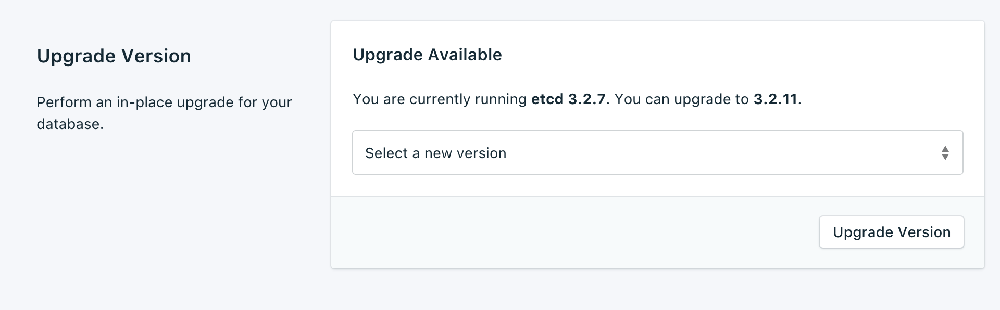
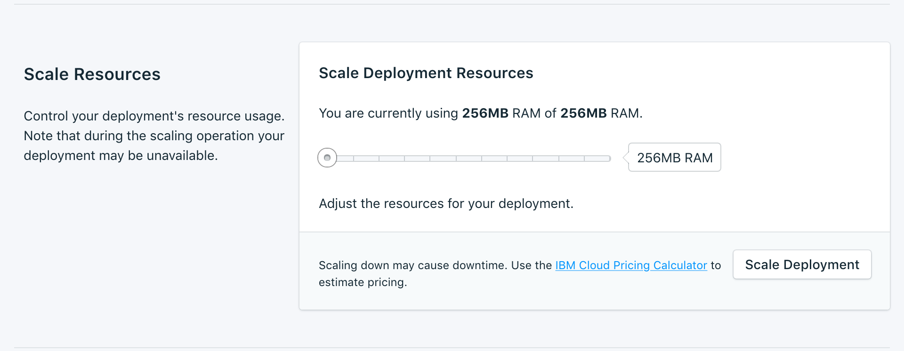

---

Copyright:
  years: 2017,2018
lastupdated: "2017-10-23"
---

{:new_window: target="_blank"}
{:shortdesc: .shortdesc}
{:screen: .screen}
{:codeblock: .codeblock}
{:pre: .pre}
{:tip: .tip}

# Configurações

Esses recursos permitem que você adapte seu serviço {{site.data.keyword.composeForEtcd_full}} para adequar melhor às suas necessidades e requisitos.

## Versão de upgrade

 Se o serviço já estiver na versão mais recente disponível, o painel exibirá as informações da versão atual. Se uma nova versão do banco de dados estiver disponível, um menu suspenso aparecerá, permitindo que você selecione uma versão para a qual fazer upgrade.

## Escalando recursos

Se o seu serviço precisa de memória adicional, ou você deseja reduzir a quantia de memória alocada para seu serviço, é possível fazer isso escalando recursos.

1. Navegue para a página de visão geral do painel de seu serviço.
2. Na área de janela _Detalhes da implementação_, clique em **Escalar recursos**. A página Escalar recursos é aberta.
    
3. Ajuste a régua de controle para aumentar ou reduzir a memória alocada para o serviço {{site.data.keyword.composeForEtcd}}. Mova a régua de controle para a esquerda para reduzir a quantia de memória ou mova-a para a direita para aumentar a memória.
4. Clique em **Escalar implementação** para acionar o novo ajuste de escala e retorne para a visão geral do painel. 

Quando o ajuste de escala for concluído, a área de janela _Detalhes da implementação_ será atualizada para mostrar o uso atual e o novo valor para a memória disponível.

## Mudar senha

Você pode achar necessário mudar a senha de seu serviço. É possível fazer isso no painel _Mudar senha_. 

É possível usar a senha gerada aleatoriamente criada para você ou digitar sua própria senha no campo. Para gerar novamente uma nova senha aleatória, clique no dado à direita do campo. 
  

Clique em **Atualizar senha**. Será solicitado que você confirme a mudança. Clique em **Atualizar senha** no diálogo para confirmar a nova senha ou cancele para cancelar a mudança. A área de janela _Detalhes da implementação_ mostra o progresso da tarefa em execução.

**Nota:** a troca da senha muda as credenciais que você e os seus serviços usam para se conectar e invalida a sequência de conexões do seu serviço. Ela também pode resultar em tempo de inatividade.

### Atualizando aplicativos conectados
Mudar a senha invalida a sequência de conexões existente e gera uma nova. Isso pode causar uma interrupção no serviço até que os aplicativos conectados sejam atualizados com a nova sequência de conexões.

Para obter mais informações sobre como conectar seus aplicativos, consulte [Conectando um aplicativo do {{site.data.keyword.cloud}}](./connecting-bluemix-app.html).
e [Conectando um aplicativo externo](./connecting-external.html).

## Usando listas de desbloqueio

Se você deseja restringir o acesso a seus bancos de dados, é possível incluir na lista de desbloqueio endereços IP específicos ou intervalos de endereços IP em seu serviço. Quando não houver endereços IP na lista de desbloqueio, a lista de desbloqueio será desativada e a implementação aceitará conexões de qualquer sistema na Internet.

### Endereços IP
O campo *IP* pode assumir um único endereço IPv4 ou endereço IPv6 completo com ou sem uma máscara de rede. Sem uma máscara de rede, as conexões recebidas devem vir exatamente desse endereço IP. 

**Nota:** embora a entrada de IP permita IPv6, nenhuma implementação do Compose está disponível atualmente para a rede IPv6 e, portanto, esses endereços não podem ser filtrados.

### Máscaras de rede
Para permitir uma conexão de um intervalo especificado de endereços IP, use uma máscara de rede. O endereço IP deve ser totalmente especificado ao usar uma máscara de rede. Isso significa inserir, por exemplo, `192.168.1.0/24` em vez de `192.168.1/24`.

### Descrição
A *Descrição* pode ser qualquer texto para identificar a entrada da lista de desbloqueio - um nome de cliente, um identificador de projeto ou um número de funcionário, por exemplo. O campo de descrição é obrigatório.

### Serviços do Compose
As entradas da lista de desbloqueio são incluídas automaticamente nos servidores do Compose para permitir que eles se conectem.

### Removendo Endereços IP com Whitelisted
Para remover um endereço IP ou uma máscara de rede da Lista de desbloqueio, clique em *Remover IP* na linha correspondente.
Quando todas as entradas na lista de desbloqueio forem removidas, a lista de desbloqueio será desativada e todos os endereços IP serão aceitos pelos portais de acesso TCP.
